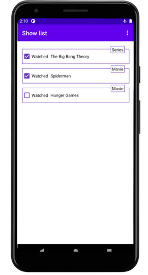
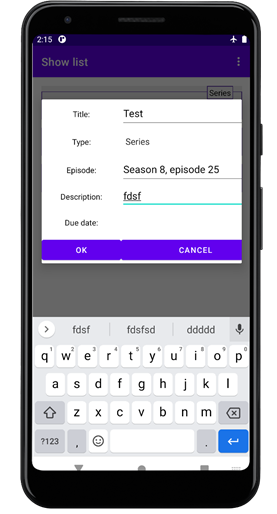
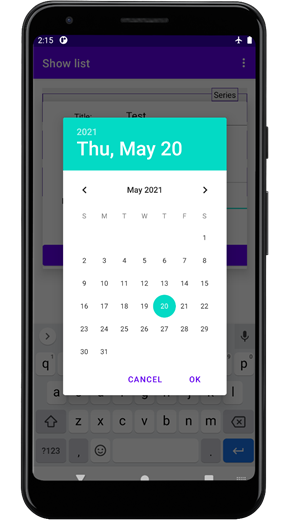

# Android alapú szoftverfejlesztés nagyházi

Megnézendő műsorok tárolására alkalmas alkalmazás.

## Felhasznált technológiák

 - Room könyvtár (SQLite)
 - LiveData
 - Notificationök és AlarmManager
 - RecyclerView
 - DatePickerDialog

## Példaképek

